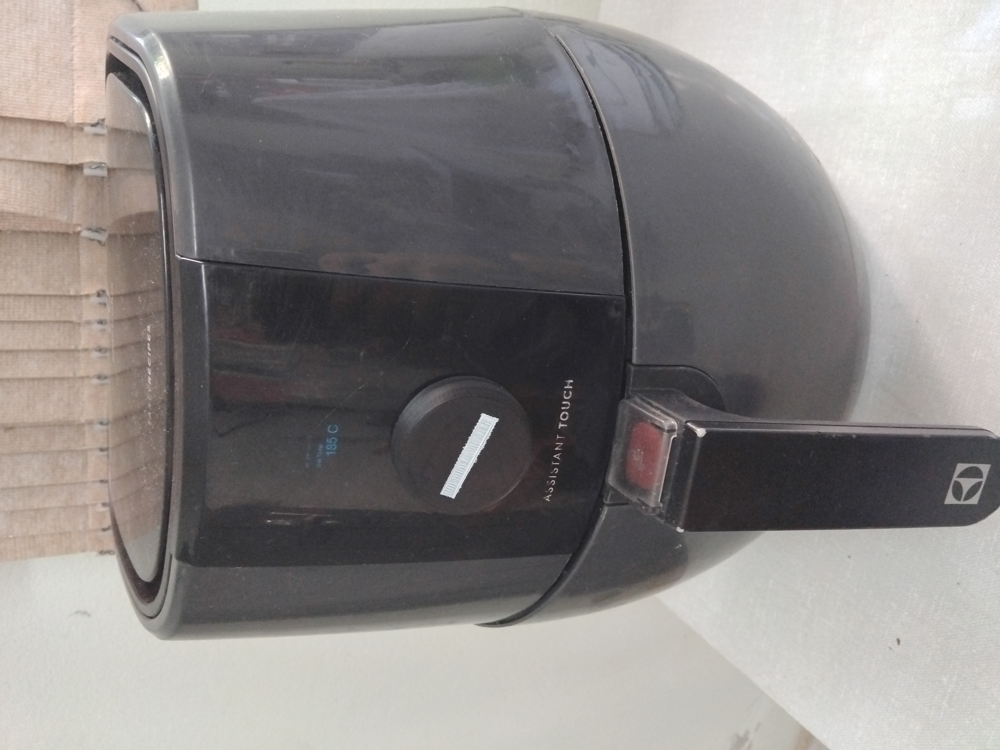
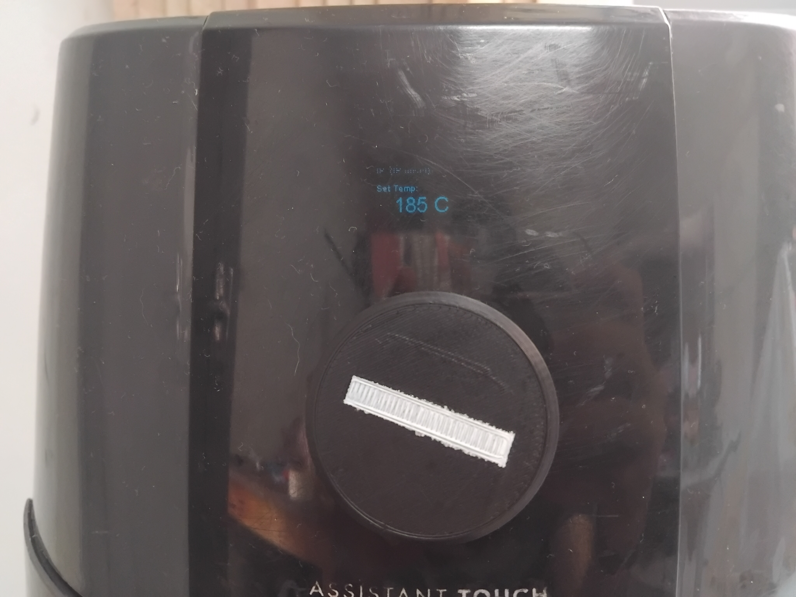
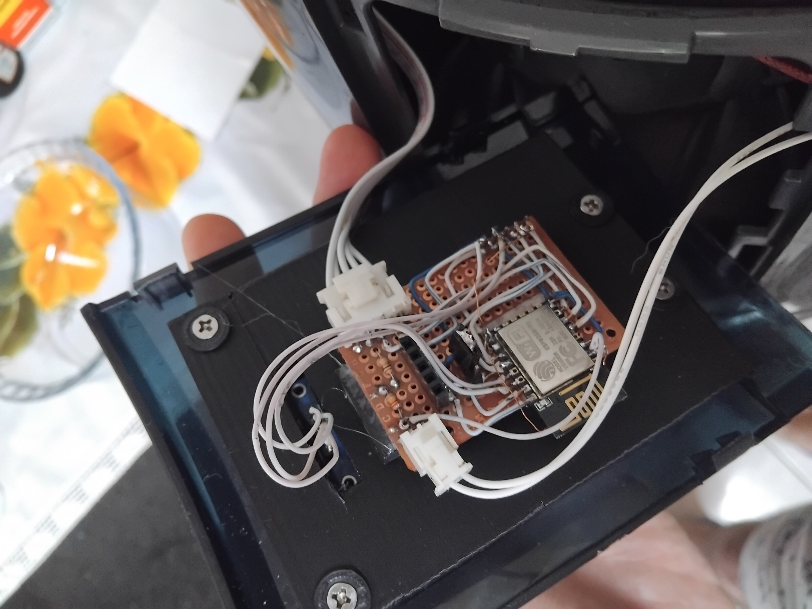

Fixed a faulty airfryer by replacing the main board with a custom board.

Originally this model had a touch interface, consisting of several touch buttons and a 3 digit seven segment display, but due to a power supply failure, the device was thrown away.
At first I fixed the device by replacing the faulty components in the power supply, and that seemed to have worked well, but soon after the touch buttons died and so did the power supply (again).
So I replaced the main board, using an esp8266-12E module as the brains, mostly for the OTA updates (but also because this module has been in the back of my drawer unused for years at this point), but honestly a simpler microcontroller would have done the job just as well.

